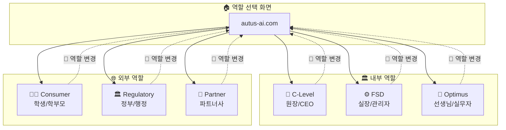
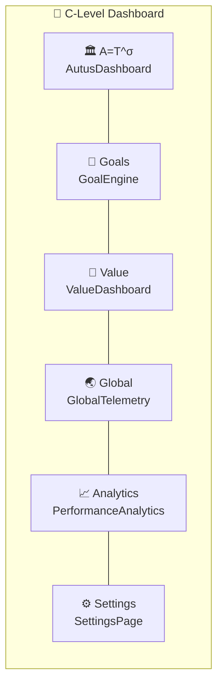
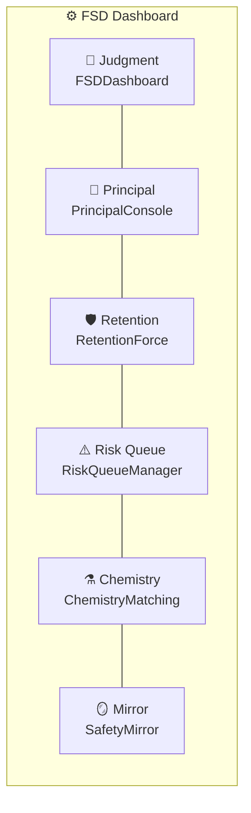
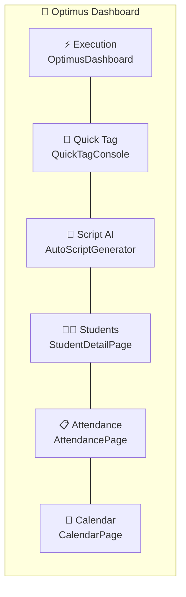
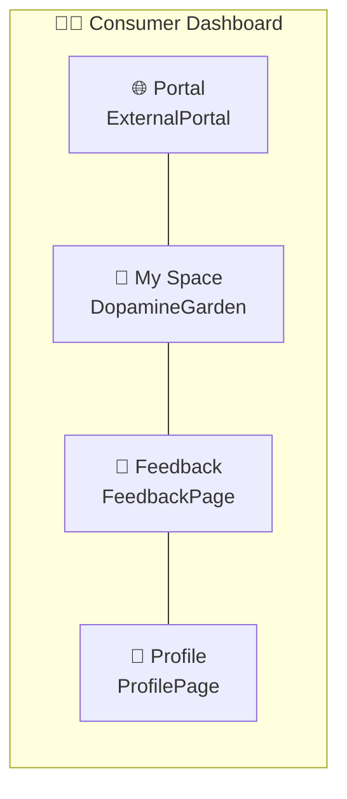
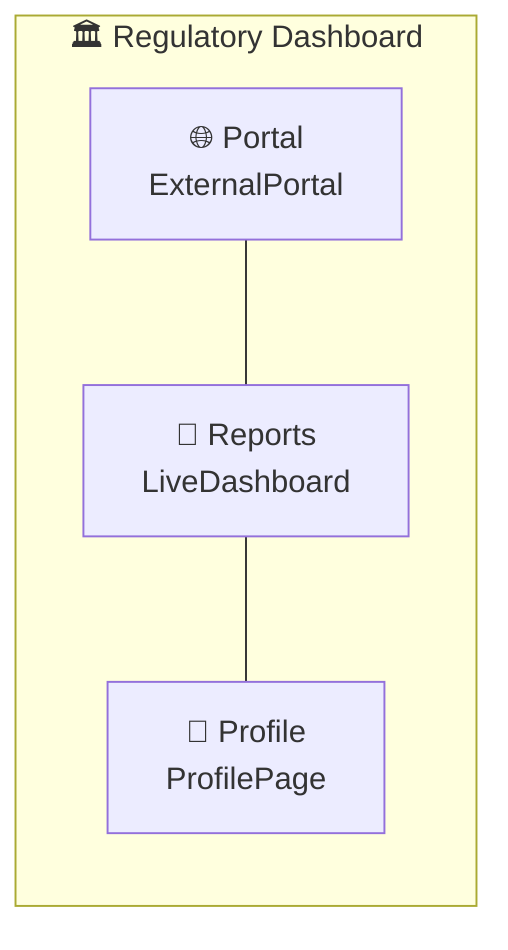
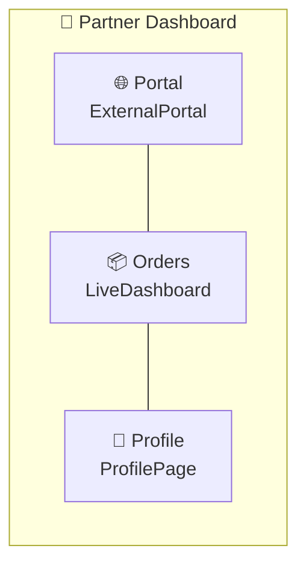
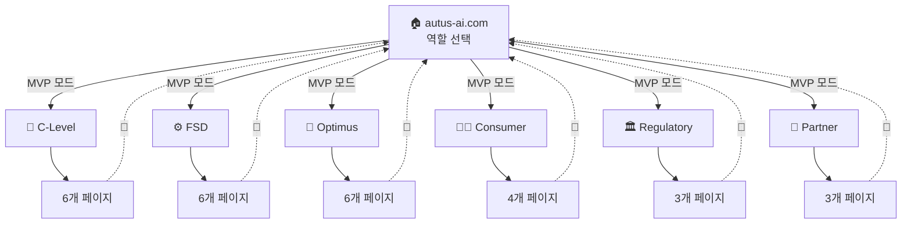

# 🗺️ AUTUS 네비게이션 맵

> 역할별 버튼 연결 구조도

## 전체 구조

---

## 👑 C-Level (원장/CEO) 네비게이션

### C-Level 메뉴 설명

| 버튼 | 페이지 | 기능 |
|------|--------|------|
| 🏛️ A=T^σ | AutusDashboard | 핵심 지표 대시보드, V-Index 현황 |
| 🎯 Goals | GoalEngine | 목표 설정 및 진척도 관리 |
| 💎 Value | ValueDashboard | 자산 가치화 현황, STU 계산 |
| 🌏 Global | GlobalTelemetry | 글로벌 데이터 (한국/필리핀) |
| 📈 Analytics | PerformanceAnalytics | 성과 분석, 트렌드 |
| ⚙️ Settings | SettingsPage | 시스템 설정 |

---

## ⚙️ FSD (실장/관리자) 네비게이션

### FSD 메뉴 설명

| 버튼 | 페이지 | 기능 |
|------|--------|------|
| 🎯 Judgment | FSDDashboard | 판단 대시보드, 의사결정 지원 |
| 👔 Principal | PrincipalConsole | 원장 콘솔, 알림 관리 |
| 🛡️ Retention | RetentionForce | 이탈 방지, 유지율 관리 |
| ⚠️ Risk Queue | RiskQueueManager | 위험 학생 목록, 우선순위 |
| ⚗️ Chemistry | ChemistryMatching | 선생님-학생 매칭 |
| 🪞 Mirror | SafetyMirror | 학부모 앱 패턴 분석 |

---

## 🔨 Optimus (선생님/실무자) 네비게이션

### Optimus 메뉴 설명

| 버튼 | 페이지 | 기능 |
|------|--------|------|
| ⚡ Execution | OptimusDashboard | 오늘의 작업, 실행 대시보드 |
| 📝 Quick Tag | QuickTagConsole | 빠른 태깅, 현장 데이터 입력 |
| 🤖 Script AI | AutoScriptGenerator | AI 스크립트 생성 |
| 👩‍🎓 Students | StudentDetailPage | 학생 상세 정보 |
| 📋 Attendance | AttendancePage | 출석 관리 |
| 📅 Calendar | CalendarPage | 일정 관리 |

---

## 👩‍🎓 Consumer (학생/학부모) 네비게이션

### Consumer 메뉴 설명

| 버튼 | 페이지 | 기능 |
|------|--------|------|
| 🌐 Portal | ExternalPortal | 메인 포털, 출석/성적/V-포인트 |
| 🌱 My Space | DopamineGarden | 개인 공간, 게이미피케이션 |
| 📝 Feedback | FeedbackPage | 피드백 제출 |
| 👤 Profile | ProfilePage | 프로필 설정 |

---

## 🏛️ Regulatory (정부/행정) 네비게이션

---

## 🤝 Partner (파트너사) 네비게이션

---

## 🔄 전체 플로우 요약

---

## 📊 페이지 매트릭스

| 역할 | 페이지 수 | 공통 페이지 |
|------|----------|------------|
| C-Level | 6 | SettingsPage |
| FSD | 6 | - |
| Optimus | 6 | CalendarPage |
| Consumer | 4 | ProfilePage, FeedbackPage |
| Regulatory | 3 | ProfilePage, ExternalPortal |
| Partner | 3 | ProfilePage, ExternalPortal |

**총 고유 페이지**: 18개

---

*Last Updated: 2026-01-26*
